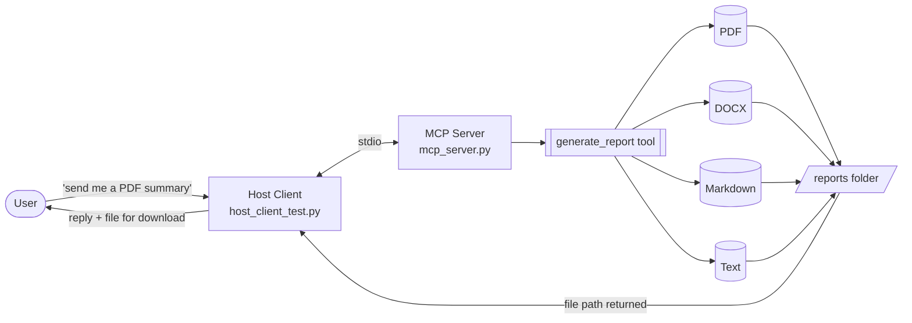
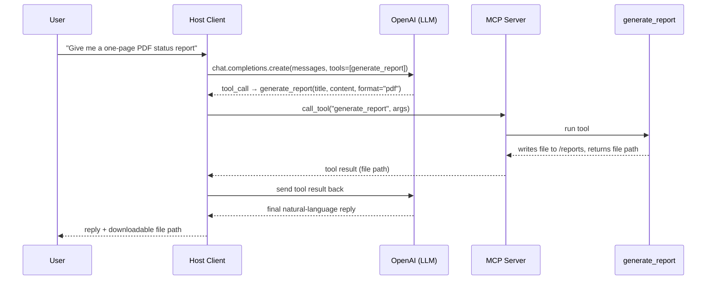
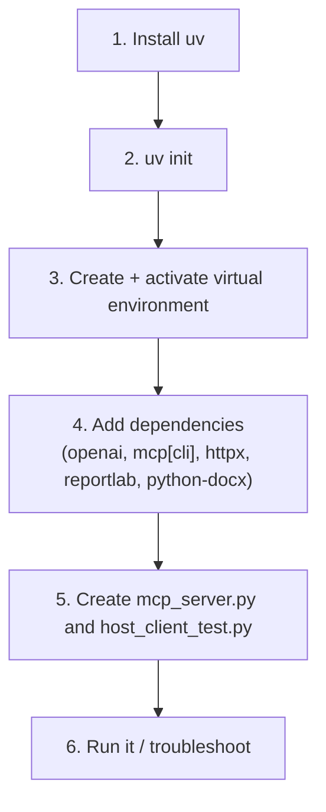

# MCP Server Setup — Reusable Report Generator Template

An MCP (Model Context Protocol) server + OpenAI-powered host client, set up with `uv`.
Beyond the base setup, this repo doubles as a **reusable template for a report-generation
tool**: the server exposes a `generate_report` tool that any connected LLM can call to turn
plain text into a downloadable **PDF, Word (.docx), Markdown (.md), or plain text (.txt)**
file — whichever format the end user asks for.

## Architecture



## Request flow



## Setup flow



---

## Prerequisites

- Windows, macOS, or Linux
- Python 3.10+
- An OpenAI API key (for the host client)

---

## Step-by-step setup

### Step 1 — Install `uv`

```powershell
powershell -ExecutionPolicy ByPass -c "irm https://astral.sh/uv/install.ps1 | iex"
```

Restart your IDE/terminal only if `uv` isn't recognized afterward.

*(macOS/Linux: `curl -LsSf https://astral.sh/uv/install.sh | sh`)*

### Step 2 — Initialize the `uv` environment

```
uv init
```

### Step 3 — Create and activate a virtual environment

```powershell
uv venv
.venv\Scripts\Activate.ps1
```

*(macOS/Linux: `source .venv/bin/activate`)*

### Step 4 — Add dependencies

```
uv add openai "mcp[cli]" httpx reportlab python-docx
```

`reportlab` and `python-docx` are added on top of the original three so the
`generate_report` tool can produce PDF and Word files, not just text.

> **⚠️ mcp v1 vs v2 — read this before running anything**
> `mcp[cli]` currently resolves to **mcp 2.x**, which renamed the classic
> `FastMCP` class to `MCPServer` and moved its import path:
> ```python
> # v1 (older tutorials) — will now raise ModuleNotFoundError
> from mcp.server.fastmcp import FastMCP
>
> # v2 (current) — what this template uses
> from mcp.server.mcpserver import MCPServer
> ```
> The tool schema field also changed from `inputSchema` to `input_schema`.
> Both `mcp_server.py` and `host_client_test.py` in this repo already use the
> v2 API. If you're following an older FastMCP tutorial and want that exact
> API instead, pin the older line: `uv add "mcp[cli]<2"`.

### Step 5 — Create the server and client files

```
ni mcp_server.py
ni host_client_test.py
code mcp_server.py
```

Use the versions in this repo (see below) rather than starting from a blank
file — they already implement the reusable `generate_report` tool.

### Step 6 — Run it

```
uv run mcp_server.py          # sanity-check the server starts
uv run host_client_test.py    # runs the OpenAI-powered client against it
```

**Troubleshooting**

| Symptom | Fix |
|---|---|
| `mcp[cli]` errors when running the server | `pip install --force-reinstall "mcp[cli]"` |
| `ModuleNotFoundError: No module named 'mcp.server.fastmcp'` | You're on mcp 2.x — use `from mcp.server.mcpserver import MCPServer` (already done here), or pin `uv add "mcp[cli]<2"` for the old API |
| `AttributeError: ... has no attribute 'inputSchema'` | Same v2 change — use `t.input_schema` (snake_case) |
| OpenAI call fails with an auth error | Set `OPENAI_API_KEY` in your environment |

---

## Project structure

```
.
├── mcp_server.py          # MCP server exposing the generate_report tool
├── host_client_test.py    # Example OpenAI-powered host client
├── reports/                # Generated PDF/DOCX/MD/TXT files (created on first run)
├── pyproject.toml          # Managed by uv
├── .gitignore              # Ignores .venv/, reports/, __pycache__/, .env
└── README.md
```

---

## The reusable `generate_report` tool

One tool, four output formats — pick whichever the user needs at call time.

| Parameter | Type | Default | Description |
|---|---|---|---|
| `title` | string | — | Report title / heading |
| `content` | string | — | Body text; blank lines separate paragraphs |
| `format` | `"pdf" \| "docx" \| "md" \| "txt"` | `"pdf"` | Output format |
| `filename` | string (optional) | auto-generated | Output filename, without extension |

**Example prompts to the host client:**

- *"Summarize this into a PDF report titled 'Q3 Review'."* → `.pdf`
- *"Same thing, but as a Word doc I can edit."* → `.docx`
- *"Just give me the markdown version for the wiki."* → `.md`
- *"Plain text is fine."* → `.txt`

Every generated file lands in `./reports/` and the tool returns its absolute
path, which `host_client_test.py` surfaces back to the user as the
"download" — swap in your own file-serving/upload logic there if the host
client is a web app rather than a CLI script.

---

## Extending the template

- **More formats:** add an `_write_html` / `_write_csv` helper and extend `ReportFormat`.
- **Remote access:** switch `mcp.run(transport="stdio")` to `transport="streamable-http"` to expose the server over HTTP instead of local stdio.
- **Use with Claude Desktop / Claude Code** instead of the OpenAI client: register `mcp_server.py` as an MCP server in its config and skip `host_client_test.py` entirely.
- **Persistent storage:** point `REPORTS_DIR` at cloud storage (S3, GCS, Drive) and return a signed URL instead of a local path.
